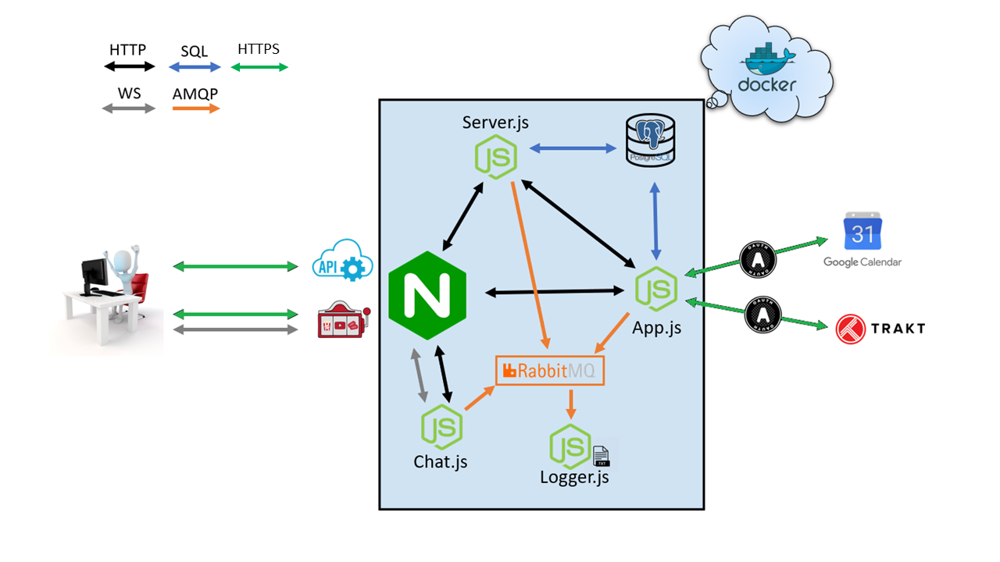

# Progetto Reti di Calcolatori - Moodies

# Descrizione
Moodies è un'applicazione che suggerisce agli utenti film da vedere in base al loro mood o al genere del film desiderato.

# Tecnologie Utilizzate
* API: Trakt.tv
* API: Google Calendar
* AMQP: RabbitMQ
* Web Socket: Socket.io
* Database: PostgreSQL
* Web Server: Nginx
* HTTPS: OpenSSL
* Container: Docker

# Schema


# Indicazioni sul soddisfacimento dei requisiti
Moodies:
* offre delle [API documentate](doc/API_Documentation.md);
* si collega a due API REST esterne: [Trakt.tv](https://trakt.docs.apiary.io) e [Google Calendar](https://developers.google.com/calendar); 
* usa OAuth per autenticarsi ad entrambe le API;
* utilizza AMQP per comunicare con un server che effettua logging.


# Istruzioni per l'istallazione
1) Tramite git clonare il repository utilizzando il comando ```git clone http://github.com/GMN177/ProgettoReti.git```;
2) installare docker;
3) esegiure il comando ```docker-compose up --build -d```;  
4) accedere al container postgres, creare un db chiamato "progetto_reti" e popolarlo con il contenuto del file [moviesql.sql](db/moviesql.sql).


# Utilizzo
1) Aprire il browser e andare su [localhost](https://localhost);
2) nella homepage è possibile selezionare un insieme di generi o un mood;
3) cliccando su "Start Spin" verrà generato un film secondo i parametri scelti; 
4) dopo aver premuto su "View Movie Page", verranno mostrate all'utente tutte le informazioni riguardanti il film, e potrà, dopo aver fatto il login, aggiungere il film al profilo e/o alla sua watchlist di Trakt.tv;
5) l'utente ha quindi la possibilità di registrarsi, in modo tale da avere a disposizione un profilo, collegabile agli account di Google e di Trakt.tv
6) nel profilo l'utente visualizzarà tutti i film che ha precendemente salvato; inoltre, può creare un evento, tramite google calendar, per programmare la visione di un film;
7) dalla homepage è anche possibile accedere ad una chat, nella quale l'utente potrà unirsi a diverse stanze, ognuna per un mood.
